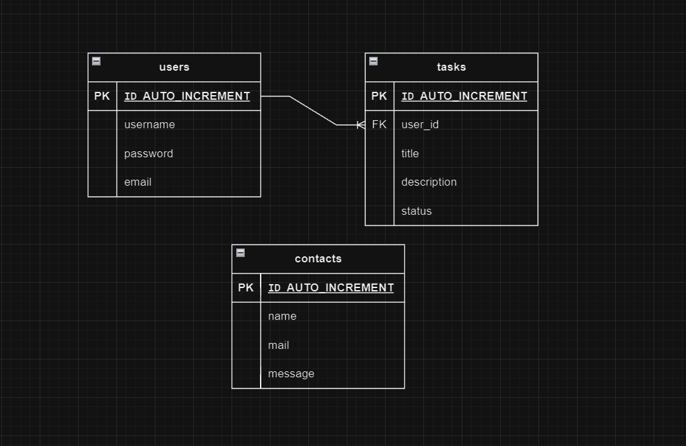

Milestone 1: Configurazione dell'ambiente
Obiettivi:
Installare e configurare un server locale (es. XAMPP, WAMP o Docker).
Creare la struttura del progetto.

Milestone 2: Sistema di Login e Registrazione
Obiettivi:
Creare un modulo di registrazione.
Implementare il login con sessioni.
Proteggere le password con hashing.
Validare input lato server.

Milestone 3: Creazione della To-Do List
Obiettivi:
Creare una pagina dove un utente loggato può aggiungere task.
Mostrare la lista dei task dell’utente.
Permettere di segnare i task come completati o cancellarli.

Milestone 4: Form di Contatto
Obiettivi:
Creare un form per inviare messaggi all’amministratore.
Implementare l’invio di email tramite PHP.

Milestone 5: UI e miglioramenti
Obiettivi:
Migliorare la presentazione con HTML e CSS.
Aggiungere messaggi di errore/successo leggibili per l’utente.
Rendere l'app mobile-friendly.

Milestone 6: Refactoring e sicurezza
Obiettivi:
Separare il codice in file riutilizzabili (es. moduli per login, registrazione, gestione task).
Aggiungere misure di sicurezza.
Configurare il progetto su GitHub.

Milestone 7: Pubblicazione
Obiettivi:
Mettere l’app online per mostrarla come demo.
Scrivere documentazione su GitHub.

Riepilogo delle Milestone:
Milestone Obiettivo

1. Ambiente Configurare server locale e repository GitHub.
2. Login/Register Creare sistema di autenticazione sicuro.
3. To-Do List Implementare funzionalità CRUD per gestire task.
4. Form Contatto Aggiungere un form con invio email.
5. UI Migliorata Rifinire interfaccia e creare design responsive.
6. Refactoring Ottimizzare codice e aggiungere misure di sicurezza.
7. Pubblicazione Rendere disponibile l’app online con documentazione dettagliata.

Milestone Aggiornata: Configurazione e Gestione del Database
Obiettivi:
Progettare la struttura del database per il progetto.
Creare il database e le relative tabelle.
Connettere il database all'applicazione tramite PHP.

Diagramma ER

